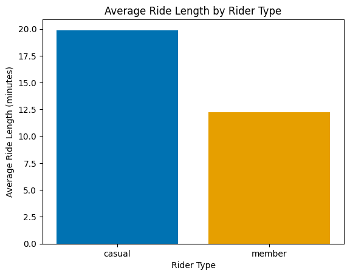
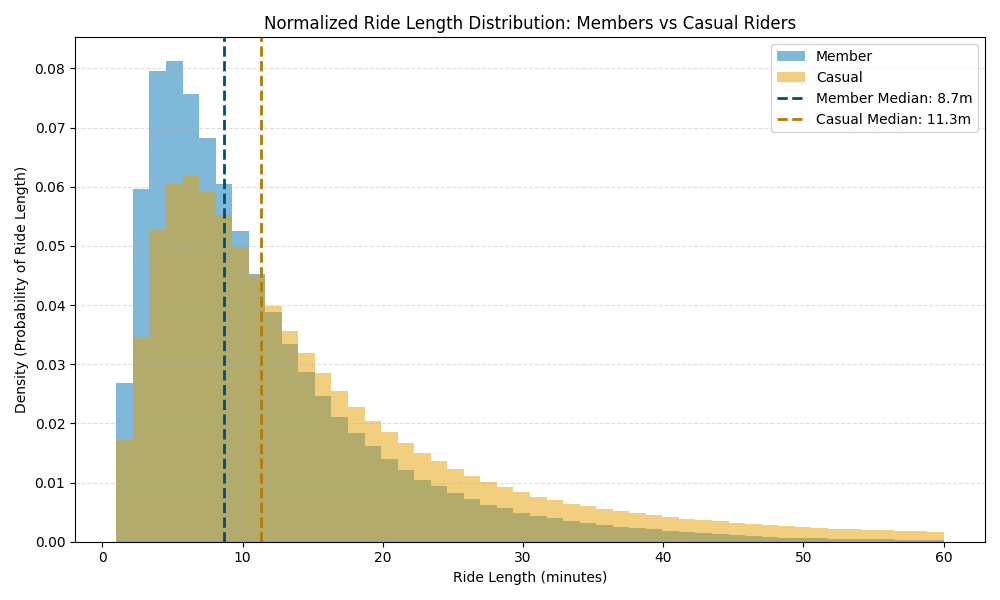
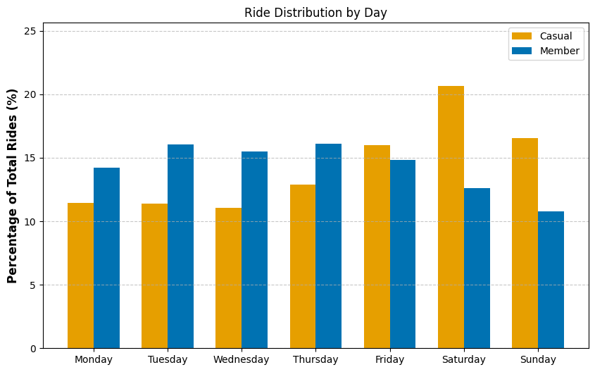
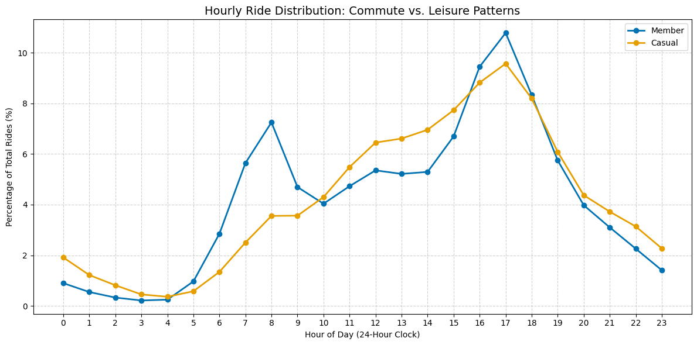
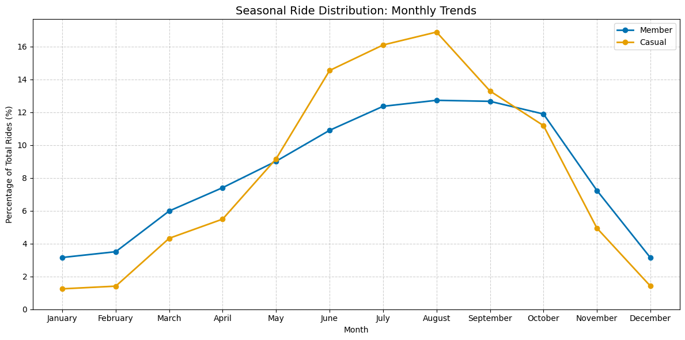

# 🚴 Cyclistic Bike-Share Case Study

## Executive Summary

This project analyzes behavioral differences between **casual riders** and **annual members** using 12 months of Cyclistic bike-share trip data.

The goal is to identify usage patterns associated with casual riders and generate **data-driven marketing insights** that could help convert them into annual members.

The analysis reveals that:

- Casual riders take **longer rides on average**
- Members exhibit **clear weekday commuting patterns**
- Casual riders are **more active on weekends**
- Casual usage increases significantly during **warmer months**

These behavioral differences suggest that casual riders primarily use the bike-share system for **leisure and recreational trips**, while members rely on it for **routine transportation**.

Based on these findings, targeted **weekend promotions, seasonal membership campaigns, and location-based marketing strategies** could help increase membership conversion.

---

# Key Findings

- Casual riders take rides **~63% longer** on average than members.
- Member usage peaks during **weekday commuting hours (8 AM and 5 PM)**.
- Casual riders demonstrate **strong weekend activity**.
- Both groups ride more in **summer months**, but casual usage increases more sharply.
- Behavioral patterns strongly indicate **transportation vs recreational usage differences**.

---

# Phase 1 — ASK

## Business Task

Analyze behavioral differences between casual riders and annual members using historical trip data to identify usage patterns associated with remaining a casual rider and support data-driven marketing decision-making aimed at increasing membership conversion.

---

## Stakeholders

**Lily Moreno (Director of Marketing)**  
Responsible for developing and executing marketing campaigns and evaluating marketing ROI.

**Cyclistic Marketing Analytics Team**  
Responsible for collecting and analyzing ride data to guide marketing strategy.

**Cyclistic Executive Team**  
Responsible for approving strategic initiatives that support long-term company growth.

---

## Success Criteria

- Clear behavioral differentiation between casual riders and members
- Statistically supported trend identification
- Identification of potential rider segments for conversion
- Executive-ready visualizations
- Actionable marketing recommendations supported by data

---

## Constraints

- Limited to **12 months of historical ride data**
- No **personally identifiable information (PII)**
- No demographic data
- Behavioral analysis only (no causal inference)

---

# Phase 2 — PREPARE

## Dataset Description

The dataset contains **trip-level operational data** from Cyclistic's bike-share system. Each row represents a completed ride and includes information such as ride timestamps, start and end stations, bike type, geographic coordinates, and rider classification (`member` or `casual`).

The dataset spans **12 monthly CSV files** representing one full year of ride activity.

Because the dataset does not include personally identifiable information, the analysis focuses on **aggregate behavioral patterns rather than individual user tracking**.

---

## Data Organization

Project files are organized to ensure **data integrity and reproducibility**.

- `data/raw/` — Original monthly datasets
- `data/processed/` — Cleaned dataset used for analysis
- `notebooks/` — Jupyter notebook containing analysis code
- `images/` — Generated visualizations

---

## ROCCC Evaluation

**Reliable**  
Operational trip data collected directly from the bike-share system.

**Original**  
Provided by Motivate International Inc. under Divvy Bikes licensing.

**Comprehensive**  
Contains timestamps, stations, bike types, and rider classification.

**Current**  
Covers the most recent 12-month period.

**Cited**  
Publicly available under stated licensing terms.

---

# Phase 3 — PROCESS

## Data Cleaning and Feature Engineering

After merging all monthly datasets, the dataset contained:

**5,552,092 ride records**

A structured cleaning pipeline was implemented to ensure analytical reliability.

---

## Column Standardization

- `started_at` → `ride_start_datetime`
- `ended_at` → `ride_end_datetime`

Both variables were converted to datetime format.

---

## Duplicate Handling

Duplicate ride records were removed to ensure each row represents a unique ride event.

---

## Station Name Recovery

Rows with missing station names were recovered using **coordinate-based station mapping**.

- Latitude/longitude rounded to 4 decimals
- Known coordinate–station pairs used as lookup
- Unresolved stations labeled **Public Rack/Unknown**

This preserved ride records while minimizing data loss.

---

## Ride Duration Engineering

A new feature was created:

```

ride_length_mins = ride_end_datetime − ride_start_datetime

```

This variable serves as the primary metric for comparing rider behavior.

---

## Outlier Filtering

Trips were filtered to remove unrealistic durations:

- Removed rides ≤ **1 minute**
- Removed rides ≥ **24 hours**

---

## Cleaning Impact

| Metric | Value |
|------|------|
| Initial rows | 5,552,092 |
| Removed rows | 154,280 |
| Final dataset | **5,397,812 rides** |

---

# Phase 4 — ANALYZE

## Ride Duration Comparison

| Rider Type | Average Ride Length |
|-------------|--------------------|
| Casual Riders | ~19.9 minutes |
| Annual Members | ~12.2 minutes |

Casual riders take significantly longer rides on average.



Additionally, **61.18% of rides longer than 30 minutes are taken by casual riders**, suggesting recreational usage.

---

## Ride Duration Distribution

To better understand ride behavior, the distribution of ride lengths was analyzed for both rider types.



Members show a tighter concentration of shorter rides, while casual riders exhibit a wider distribution with a longer tail toward extended ride durations. This reinforces the interpretation that casual riders are more likely engaging in leisure-oriented trips.

---

## Weekly Riding Patterns

Members demonstrate stronger weekday usage, while casual riders show higher activity on weekends.



This pattern aligns with **commuting behavior for members** and **leisure usage for casual riders**.

---

## Hourly Riding Patterns

Members exhibit pronounced ride peaks around **8 AM** and **5 PM**, consistent with commuting schedules.

Casual rider activity increases throughout the day and peaks during the afternoon.



---

## Seasonal Usage Trends

Ride volume increases for both rider groups during warmer months.



Casual rider activity increases more dramatically, suggesting stronger seasonal dependence.

---

# Phase 5 — SHARE

## Key Insights

**Ride Duration**  
Casual riders take longer rides on average and account for the majority of rides exceeding 30 minutes.

**Weekly Behavior**  
Members ride primarily during weekdays, while casual riders show higher weekend activity.

**Daily Patterns**  
Member rides peak during commuting hours; casual riders ride later in the day.

**Seasonality**  
Casual ridership increases significantly during summer months.

---

## Recommendations

### 1. Weekend and Long-Ride Incentives
Offer targeted promotions emphasizing cost savings for longer rides and weekend usage.

### 2. Membership Value Messaging
Promote membership savings through app notifications and station-level marketing.

### 3. Seasonal Membership Campaigns
Launch membership promotions during peak riding seasons when casual rider activity is highest.

---

## Next Steps

**Station-Level Behavioral Analysis**

Analyze station usage to identify locations with high casual ridership (parks, tourist areas, waterfronts).

**Location-Based Conversion Opportunities**

Target stations with high casual activity but low member usage with localized promotions.

---

# Tools Used

- Python
- Pandas
- NumPy
- Matplotlib
- Jupyter Notebook
- Git / GitHub

---

# Project Structure

```

cyclistic-bike-share-analysis
│
├── data
│   ├── raw
│   │   └── monthly_trip_files.csv
│   └── processed
│       └── cleaned_bike_data.csv
│
├── notebooks
│   └── cyclistic_analysis.ipynb
│
├── images
│   ├── ride_length_members_vs_casual.png
│   ├── day_of_week_distribution.png
│   ├── hourly_ride_patterns_members_vs_casual.png
│   └── monthly_ride_distribution.png
│
├── requirements.txt
├── .gitignore
└── README.md